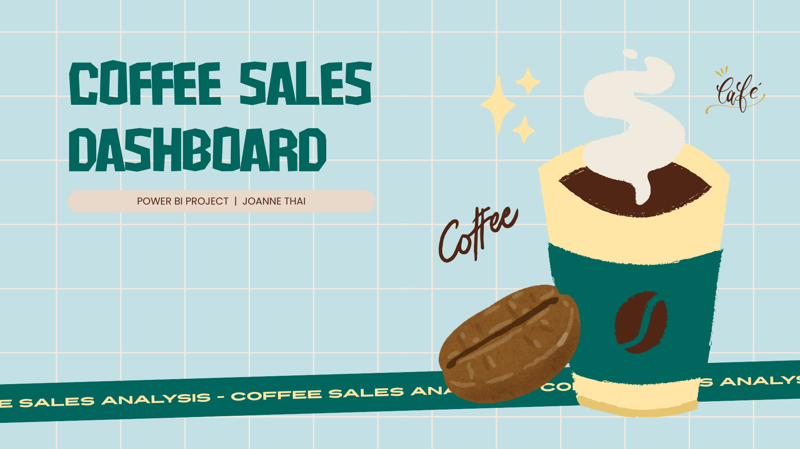
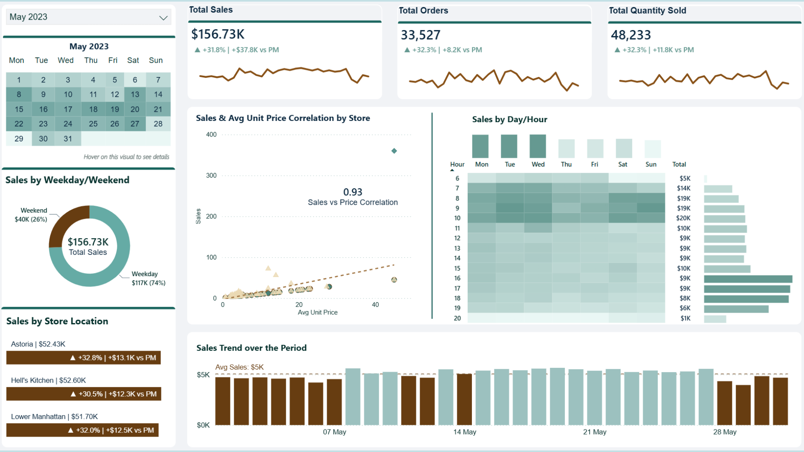

# Coffee Sales Analytics: Pricing, Demand & Product Insights

Pinpointing which pricing and category shifts could unlock revenue growth across stores.

> GitHub does not support live Power BI iframes inside README files, so the dashboard preview below links out to the interactive report.

## At a Glance

| Area | Details |
| --- | --- |
| Business problem | Understand which products, pricing patterns, and operating periods are driving store-level sales performance. |
| Dataset scope | Multi-store transactional sales with product, quantity, price, timestamp, and location data. |
| Tools | Power BI, Python, Excel, DAX |
| Analysis focus | EDA, trend analysis, pricing strategy, demand analysis, product segmentation, KPI design |

## Dashboard Preview

## Overview

This project transformed coffee shop transaction data into a decision-ready view of revenue drivers, product performance, pricing behaviour, and time-based demand patterns across multiple store locations.

## Business Problem

The business needed a clearer view of which products, pricing patterns, and operating periods were driving sales performance. Leadership wanted to understand where revenue was concentrated, where demand was sensitive to price, and how store-level performance differed across locations and time windows.

## Dataset

The dataset contains transactional sales across multiple stores, including product details, quantities sold, unit prices, timestamps, and store locations. A star schema model was built around a central fact table with supporting product, store, date, and time dimensions, plus a derived product summary table for segmentation analysis.

## Approach

- Modelled the data using a star schema with `fact_Sales` supported by product, store, date, and time dimensions.
- Built DAX measures for sales, orders, quantity sold, average unit price, and other comparative KPIs.
- Used correlation analysis and quadrant-style product segmentation to examine price, demand, and revenue relationships.
- Designed three analytical views covering monthly performance, product insights, and sales drivers with short-term forecasting.

## Key Insights

- Revenue is highly concentrated in coffee and tea products, with a small set of top-performing items driving most sales.
- Higher prices tend to reduce demand at the product level, but stores with higher average pricing still generate stronger revenue overall.
- Sales are stable with a slight upward trend, with strongest demand in the morning and occasional evening sales spikes.

## Recommendations

- Focus product and promotional attention on high-performing core items while reviewing weaker products for removal, bundling, or repositioning.
- Maintain pricing strength on leading products and test targeted pricing changes only on weaker items with softer demand.
- Align staffing and inventory planning with peak morning demand and use targeted campaigns to capture evening sales opportunities.

## Tools Used

- Power BI
- Python
- Excel
- DAX

## Project Visuals

| Cover | Dashboard |
| --- | --- |
|  |  |

## Repository Contents

| File | Purpose |
| --- | --- |
| [`coffee_sales_project.pbix`](./coffee_sales_project.pbix) | Power BI dashboard file |
| [`data.xlsx`](./data.xlsx) | Source dataset used for analysis |
| [`images/hero.png`](./images/hero.png) | Project cover image used in the README |
| [`images/dashboard-preview.png`](./images/dashboard-preview.png) | Dashboard screenshot preview |
