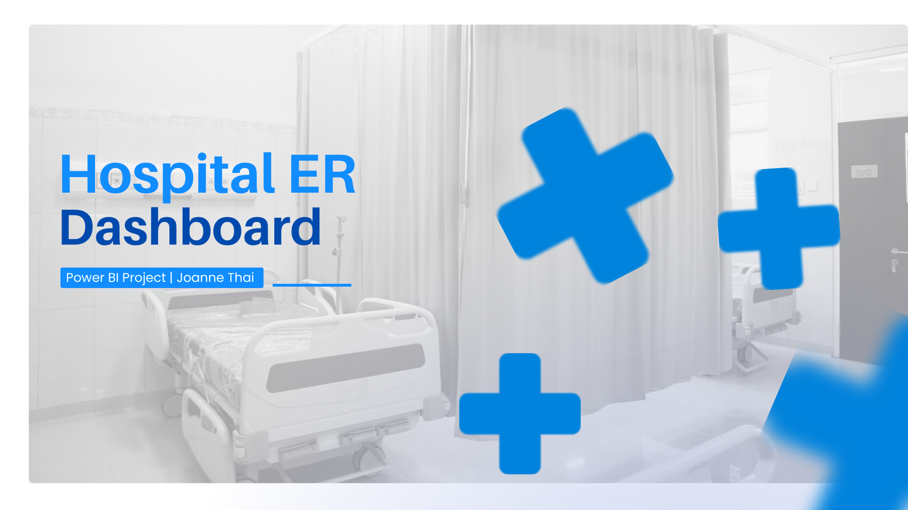
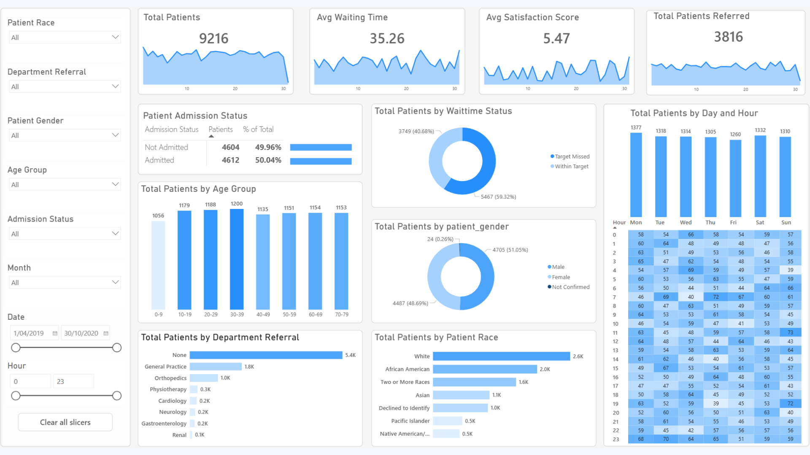

# Emergency Room Operations Analytics

Understanding patient flow, waiting times, and referral patterns to improve ER operations.

## At a Glance

| Area | Details |
| --- | --- |
| Business problem | Clarify when ER demand peaks, how patient experience behaves, and which referral pathways create the most operational pressure. |
| Dataset scope | 9,216 patient visits from April 2019 to October 2020 with timing, waiting time, satisfaction, demographics, admissions, and referrals. |
| Tools | Power BI, DAX, Data Modelling, Data Visualisation |
| Analysis focus | Time-series analysis, operational flow analysis, correlation analysis, demographic segmentation |

## Dashboard Preview

## Overview

This project analyses emergency room (ER) data to understand patient flow, waiting times, and satisfaction levels. The goal is to identify operational bottlenecks and areas for improvement in service delivery.

The dataset covers April 2019 to October 2020, with a total of 9,216 patient visits.

## Business Problem

The ER needs to manage patient demand efficiently while maintaining a good level of service. Key questions include:

- How long are patients waiting, and is it within target?  
- What factors affect patient satisfaction?  
- When does demand peak, and are resources aligned?  
- Which departments or patient groups require attention?  

Without clear visibility into these areas, it becomes difficult to improve patient experience, reduce delays, and allocate resources effectively.

## Key Metrics

- Total Patients: 9,216  
- Avg Waiting Time: 35.26 minutes  
- Avg Satisfaction Score: 5.47 / 10  
- Total Patients Referred: 3,816  
- Patients Within Target Waiting Time: ~59%  
- Patients Missing Target: ~41%  

## Data Model

The dataset is structured around patient-level records, including:

- Patient details (age, gender, race)  
- Visit information (date, hour, admission status)  
- Department referrals  
- Waiting time and satisfaction score  

Given the relatively small size of the dataset, it is kept in a single table rather than being fully normalised into separate fact and dimension tables. This simplifies the model and avoids unnecessary complexity while still supporting all required analysis.

## Approach

- Built operational KPIs in Power BI to track patient volume, waiting time, satisfaction, admissions, and referral counts.
- Used time-based analysis to identify demand peaks by weekday and hour.
- Segmented patients by age, gender, and referral outcome to understand service mix and escalation patterns.
- Tested the relationship between waiting time and satisfaction using patient-level correlation analysis.

## Analysis

### 1. Patient Flow & Admission Status

**Visuals Used:** Patient Admission Status, Total Patients KPI  

- Admitted Patients: 4,612 (50.0%)  
- Non-Admitted Patients: 4,604 (50.0%)  

The ER handles an almost perfectly balanced split between admitted and non-admitted patients. This indicates that the ER is functioning both as:
- A critical care entry point (admissions)  
- And a general treatment centre (non-admissions)  

**Impact:**  

This mix increases operational complexity, as different patient types require different levels of time, resources, and prioritisation.

### 2. Waiting Time Performance

**Visuals Used:** Avg Waiting Time KPI, Total Patients by Waittime Status  

- Avg Waiting Time: 35.26 minutes  
- Within Target: ~59%   
- Delayed: ~41%

A significant portion of patients are not being seen within the target waiting time. This suggests:
- Insufficient capacity during peak periods  
- Possible inefficiencies in triage or patient handling  

**Impact:**  

High waiting times can likely reduce patient satisfaction, increase perceived service quality issues, and create bottlenecks that affect overall throughput.

### 3. Patient Demand by Day and Hour

**Visuals Used:** Total Patients by Day and Hour (Heatmap & Bar Chart)  

**By Day:**
- Highest: Monday (~1,350 patients)  
- Weekend (Sat–Sun): ~1,280–1,300 patients  
- Lowest: Thursday (~1,250 patients)  

**By Hour:**
- Peak: 11 AM – 1 PM (~520–550 patients combined)  
- Secondary Peak: 6 PM – 8 PM (~480–500 patients)  
- Lowest: 2 AM – 6 AM (<150 patients total)

Patient volume varies by both day and hour, with clear peak periods. Demand is not evenly distributed and spikes during certain hours, particularly midday (late morning to early afternoon) and early evening. These peaks likely align with:
- Patients delaying visits until daytime hours  
- After-work visits in the evening

**Impact:**  

If staffing is evenly distributed across the day, the ER will be understaffed during peak hours or be overstaffed during low-demand periods. It can also lead to longer waiting times and overcrowding situations.

### 4. Patient Demographics  

**Visuals:** Age Group, Gender, Race  

- Gender: ~51% Male, ~49% Female  
- Largest group: Adults (30–64)  
- Other groups relatively evenly distributed
  
Patient demand is spread across multiple demographic groups, with no extreme concentration, indicating that the ER serves a broad population base rather than a niche group.

**Impact:**  

Operational improvements should focus on overall efficiency rather than targeting specific demographic segments.

### 5. Department Referral Patterns  

**Visuals:** Department Referral  

- No Referral: ~5,400 patients (~58%)  
- General Practice: ~1,800 patients  
- Orthopedics: ~1,000 patients  

The majority of patients are treated directly in the ER without referral. This suggests:
- Many cases are manageable within the ER  
- However, pressure on ER staff is increased.

**Impact:**  

High volumes without referral can slow down patient processing, increase waiting times, and reduce efficiency.
Additionally, high-referral departments (GP, Orthopedics) may become bottlenecks if not properly resourced.

### 6. Satisfaction Trends Over Time  
**Visuals:** Satisfaction by Month  

- Range: ~5.2 to ~5.9  
- Average: 5.47  
- No clear upward or downward trend  

Patient satisfaction remains relatively stable over time. There is no evidence of consistent improvement or deterioration.

**Impact:**  
The current processes are maintaining a baseline experience but not actively improving patient satisfaction  

### 7. Waiting Time vs Satisfaction  
**Visuals:** Scatter Plot  

- Correlation: −0.0022
  
There is almost no relationship between waiting time and satisfaction, suggesting that waiting time alone is not a strong driver of satisfaction.

**Impact:**  
Efforts to improve satisfaction should not focus only on reducing waiting time, but also on communication, quality of care, and interaction with patients.

### 8. Performance by Age Group  
**Visuals:** Waiting Time & Satisfaction by Age  

- Highest Satisfaction: Infants (~6.02)  
- Lowest Satisfaction: Seniors (~5.21)  
- Waiting time: relatively consistent across groups  

Satisfaction varies across age groups despite similar waiting times. This might be because different groups likely have:
- different expectations  
- different service experiences  

**Impact:**  
A “one-size-fits-all” approach may not work for patient experience.

## Key Insights

- The ER handled **9,216 patient visits** across a **19-month** period, with average waiting time at about **35 minutes** and average satisfaction at **5.47 out of 10**. This points to a consistently busy service with moderate patient experience and clear room to improve the operational journey.
- Demand is steady rather than erratic, with the heaviest pressure falling on **Mondays**, followed by **Tuesdays** and **Saturdays**, and activity clustering around midday to evening hours. Because those peaks are predictable, staffing and flow interventions can be timed more precisely instead of treating congestion as random.
- The main challenge is not just volume, but how resources are distributed and how service is delivered during high-pressure periods.
- Waiting time on its own does not explain the experience gap as well as teams might expect. The report shows an almost zero linear relationship between waiting time and satisfaction at **-0.002**, which suggests communication, care quality, and treatment outcomes likely matter more than speed alone for many patients.
- Referral activity shows that a large share of visits are relatively low-acuity, with roughly **5,400** patients needing no referral at all, while **General Practice (~1,800)** and **Orthopedics (~1,000)** handle the largest referred volumes. Since most patients are treated directly in the ER, increasing the frontline workload.
- The patient base is concentrated in the **20-39** age range, gender split is balanced, and admissions are close to **50/50**, indicating a fairly even triage mix between patients who require further treatment and those who can be discharged.

## Recommendations

### 1. Optimise Peak-Time Operations & Patient Experience

- Align staffing and operational resources more closely to midday and early-week demand peaks, for example, increase staff during 11 AM – 1 PM and 6 PM – 8 PM. 
- Introduce or expand fast-track pathways for non-critical patients to reduce congestion and improve flow.
- Improve patient experience through clearer communication and service consistency, not just shorter wait times.
- Focus on improving experience for lower-satisfaction groups (e.g. seniors) to improve the consistency in satisfaction across demographics. 

### 2. Optimise Department Workload
- Allocate more resources to General Practice and Orthopedics.
- Allocate dedicated staff for non-referral patients and reduce unnecessary referrals.
- Separate minor cases from critical care workflows by implementing initial screening to quickly route simple cases.

## Tools Used

- Power BI
- Data Transformation
- DAX
- EDA
- Data Visualisation

## Project Visuals

| Cover | Dashboard |
| --- | --- |
|  |  |

## Repository Contents

| File | Purpose |
| --- | --- |
| [`hospital_er_project.pbix`](./hospital_er_project.pbix) | Power BI dashboard file |
| [`Hospital ER.csv`](./Hospital%20ER.csv) | Source dataset used for analysis |
| [`images/hero.png`](./images/hero.png) | Project cover image used in the README |
| [`images/dashboard-preview.png`](./images/dashboard-preview.png) | Dashboard screenshot preview |
