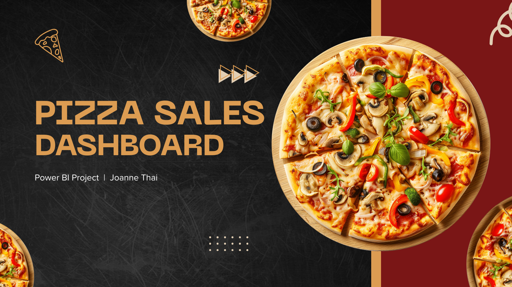
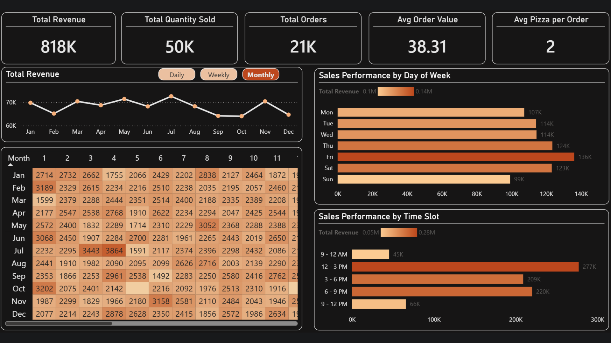

# Pizza Sales & Product Performance Analytics

Linking sales patterns, menu performance, and ingredient usage to smarter product decisions.

## At a Glance

| Area | Details |
| --- | --- |
| Business problem | Identify which products and categories drive revenue, where menu inefficiency sits, and how operational demand patterns should shape staffing and inventory decisions. |
| Dataset scope | Full-year pizza sales transactions with product, quantity, timestamp, and ingredient-level information. |
| Tools | Power BI, DAX, Data Modelling, Data Visualization |
| Analysis focus | Time-series analysis, product performance analysis, menu engineering segmentation, demand vs revenue analysis |

## Dashboard Preview

## Overview

This project analyses pizza sales data to understand customer ordering behaviour, product performance, and demand patterns over time. The focus is on identifying which products contribute most to sales, how ordering behaviour changes across different time periods, and how the menu can be optimised.

The dataset consists of order-level and product-level information, including order date and time, pizza type, category, size, quantity, and revenue. It captures customer transactions across a full year, allowing analysis of both time-based trends and product performance.

## Business Problem

The business needs to answer several key questions:

- Which pizzas and categories drive Total Revenue?  
- When do customers place orders most frequently?  
- How does demand vary across products?  
- Which products should be improved, promoted, or removed?  

Answering these questions helps improve menu design, pricing decisions, and overall sales performance.

## Dataset

The dataset covers a full year of operations, generating about $817.9K in revenue from 21K orders and 50K pizzas sold. It includes product details, quantities, timestamps, and ingredient-level information, with derived summary tables supporting product, ingredient, and menu engineering analysis.

## Data Model
The dataset is structured using a snowflake schema, separating core entities into related tables:

- Orders (order ID, date, time)  
- Order Details (product, quantity, revenue)  
- Pizzas (name, size, category)  
- Pizza Types (ingredients, descriptions)  

This structure reduces data redundancy and allows more flexible analysis across products, categories, and ingredients. 

## Approach

- Built KPI measures for revenue, orders, pizzas sold, average pizzas per order, and average order value.
- Analysed sales by daypart, weekday, category, and product to isolate stable demand patterns and peak periods.
- Used menu engineering and demand-versus-revenue comparisons to classify product performance.
- Evaluated ingredient concentration and low-usage components to identify inventory and procurement inefficiencies.

## Key Metrics
- Total Revenue: $817.9K  
- Total Quantity Sold: 50K  
- Total Orders: 21K  
- Avg Order Value: $38.3  
- Avg Pizza per Order: 2

## Analysis

### 1. Revenue & Sales Trends

**Visuals Used:** Total Revenue (Line Chart), Monthly Heatmap  

- Revenue remains relatively stable throughout the year, with moderate fluctuations. Some months (e.g. July) show higher performance, while others are slightly lower.
- Sales do not show strong seasonality.

**Impact:**  

Growth is more likely to come from improving product performance rather than relying on seasonal demand.

### 2. Sales by Day and Time

**Visuals Used:** Sales by Day of Week, Sales by Time Slot  

- Friday generates the highest revenue **(~$136K)**, followed by weekends. The peak time slot is **12–3 PM (~$277K)**, with strong demand also in the evening **(6–9 PM)**.
- Customer demand is concentrated around **lunch** and **evening** periods, especially later in the week.

**Impact:**  

Operations and promotions should focus on these high-demand windows.

### 3. Order Behaviour

**Visuals Used:** Order Composition (Donut Chart)  

- Multi-item orders account for **~61.6%** of all orders, while single-item orders make up **~38.4%**.
- Customers frequently purchase more than one pizza per order.

**Impact:**  

There is strong potential to increase revenue through bundles and upselling.

### 4. Category Performance

**Visuals Used:** Category Ranking (by Revenue)  

- **Classic pizzas** generate the highest revenue (~$220K), followed by Supreme (~$208K), Chicken (~$196K), and Veggie (~$194K).
- Demand is relatively balanced across categories, with no single category dominating entirely.

**Impact:**  

A diversified product mix reduces risk but requires consistent performance across categories.

### 5. Product-Level Performance

**Visuals Used:** Bottom 5 Products (Revenue & Quantity), Product Tables  

Several products consistently rank at the bottom in both revenue and quantity sold.  
For example:

- **Brie Carre Pizza** generates less than ~$12K in revenue and has one of the lowest order volumes  
- **Mediterranean Pizza** and **Spinach Supreme** also show low demand, with fewer than ~1,000 units sold  
- These products appear in both the bottom revenue and bottom quantity rankings  

These items have weak demand and limited contribution.

**Impact:**  

Keeping these products on the menu may reduce efficiency by increasing ingredient complexity, slowing down operations, and taking attention away from higher-performing items. Therefore, these products should be reviewed for removal, repositioning, or improvement.

## Key Insights

- The business generated approximately **$817.9K** in revenue from **21K orders** and **50K pizzas sold**, with an average order value of about **$38.3** and roughly **2 pizzas per order**. Sales are stable across the year with only minor fluctuations, which suggests a dependable business pattern rather than sharp seasonality.
- Demand is concentrated in very specific trading windows. **Fridays** are the strongest sales day, followed by **Thursdays** and **Saturdays**, while the **12 PM - 3 PM** period drives the highest revenue and evening hours provide the next-largest contribution, making lunch and dinner the critical operating dayparts.
- Order composition is a real commercial strength, not just a descriptive stat. Around **61.6%** of orders contain multiple pizzas, which confirms strong bundle-style purchasing behaviour and creates a solid case for combo offers, upselling, and promotions designed around multi-item baskets.
- Category and product performance are uneven in ways that matter strategically. **Classic** pizzas lead both in volume and revenue at roughly **$220K**, while products such as **The Classic Deluxe Pizza** and **Barbecue Chicken Pizza** stand out against weaker items like **The Brie Carre Pizza** and **Mediterranean Pizza**, showing that menu breadth is not translating evenly into value.
- Ingredient and menu-engineering analysis both point to portfolio inefficiency. High-usage ingredients such as **Garlic**, **Tomatoes**, and **Red Onions** dominate demand, while low-usage ingredients add complexity with limited payoff; at the same time, top performers contribute about **51.5%** of revenue while underperformers still account for about **37.5%**, reinforcing the need to simplify and rebalance the menu.

## Recommendations

- Staff and prep more aggressively for lunch and end-of-week peaks to support faster service during high-demand periods.
- Use bundles and upsell offers to build on strong multi-item ordering behaviour and increase average order value.
- Refine the menu by prioritising high-performing pizzas and reducing low-value products and ingredients that add complexity without strong revenue contribution.

## Tools Used

- Power BI
- DAX
- Data Modelling
- Data Visualization

## Project Visuals

| Cover | Dashboard |
| --- | --- |
|  |  |

## Repository Contents

| File | Purpose |
| --- | --- |
| [`pizza_sales_project.pbix`](./pizza_sales_project.pbix) | Power BI dashboard file |
| [`data_pizza.xlsx`](./data_pizza.xlsx) | Source dataset used for analysis |
| [`data_dictionary.xlsx`](./data_dictionary.xlsx) | Data dictionary for business fields and definitions |
| [`images/hero.png`](./images/hero.png) | Project cover image used in the README |
| [`images/dashboard-preview.png`](./images/dashboard-preview.png) | Dashboard screenshot preview |
