# Pizza Sales & Product Performance Analytics

Linking sales patterns, menu performance, and ingredient usage to smarter product decisions.

## At a Glance

| Area | Details |
| --- | --- |
| Business problem | Identify which products and categories drive revenue, where menu inefficiency sits, and how operational demand patterns should shape staffing and inventory decisions. |
| Dataset scope | Full-year pizza sales transactions with product, quantity, timestamp, and ingredient-level information. |
| Tools | Power BI, DAX, Data Modelling, Data Visualization |
| Analysis focus | Time-series analysis, product performance analysis, menu engineering segmentation, demand vs revenue analysis |

## Dashboard Preview

## Overview

This project analyses pizza sales data to understand customer ordering behaviour, product performance, and demand patterns over time. The focus is on identifying which products contribute most to sales, how ordering behaviour changes across different time periods, and how the menu can be optimised.

The dataset consists of order-level and product-level information, including order date and time, pizza type, category, size, quantity, and revenue. It captures customer transactions across a full year, allowing analysis of both time-based trends and product performance.

## Business Problem

The business needs to answer several key questions:

- Which pizzas and categories drive Total Revenue?  
- When do customers place orders most frequently?  
- How does demand vary across products?  
- Which products should be improved, promoted, or removed?  

Answering these questions helps improve menu design, pricing decisions, and overall sales performance.

## Dataset

The dataset covers a full year of operations, generating about $817.9K in revenue from 21K orders and 50K pizzas sold. It includes product details, quantities, timestamps, and ingredient-level information, with derived summary tables supporting product, ingredient, and menu engineering analysis.

## Data Model

  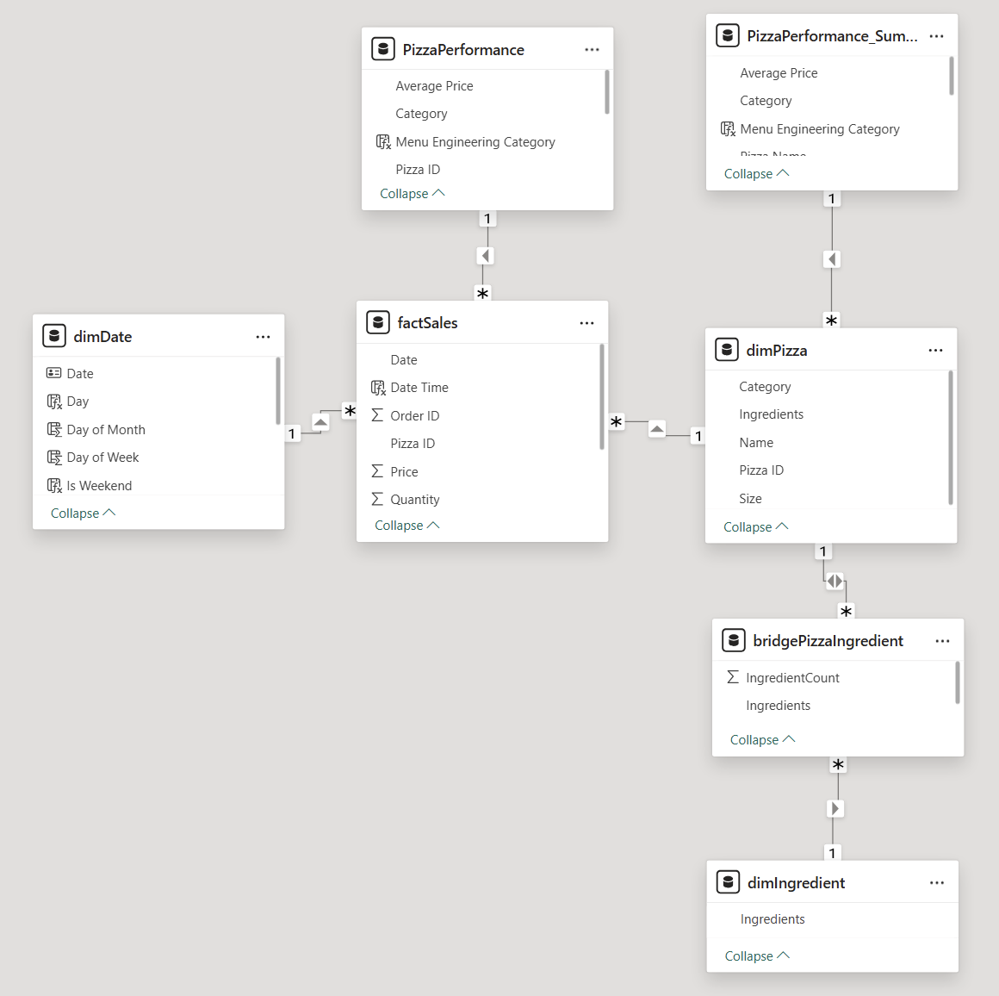

The dashboard uses a **star schema with supporting analysis tables**. The main model is centred around `factSales`, which stores order-level sales records and connects to dimension tables for date and pizza details.

- **`factSales`**: central fact table containing main sales fields 
- **`dimDate`**: date dimension used for daily, weekly, monthly, and weekend analysis
- **`dimPizza`**: pizza dimension containing pizza name, category, size, and ingredient information
- **`dimIngredient`** and **`bridgePizzaIngredient`**: support ingredient-level analysis by connecting pizzas to individual ingredients
- **`PizzaPerformance`** and **`PizzaPerformance_Summary`**: supporting tables used for menu engineering and product segmentation analysis

This model supports sales trend analysis, product performance comparison, ingredient impact analysis, and menu engineering segmentation while keeping the main sales table separate from descriptive product and date attributes.

## Approach

- Built KPI measures for revenue, orders, pizzas sold, average pizzas per order, and average order value.
- Analysed sales by daypart, weekday, category, and product to isolate stable demand patterns and peak periods.
- Used menu engineering and demand-versus-revenue comparisons to classify product performance.
- Evaluated ingredient concentration and low-usage components to identify inventory and procurement inefficiencies.

## Key Metrics

- Total Revenue: $817.9K  
- Total Quantity Sold: 50K  
- Total Orders: 21K  
- Avg Order Value: $38.3  
- Avg Pizza per Order: 2

## Analysis

### 1. Revenue & Sales Trends

  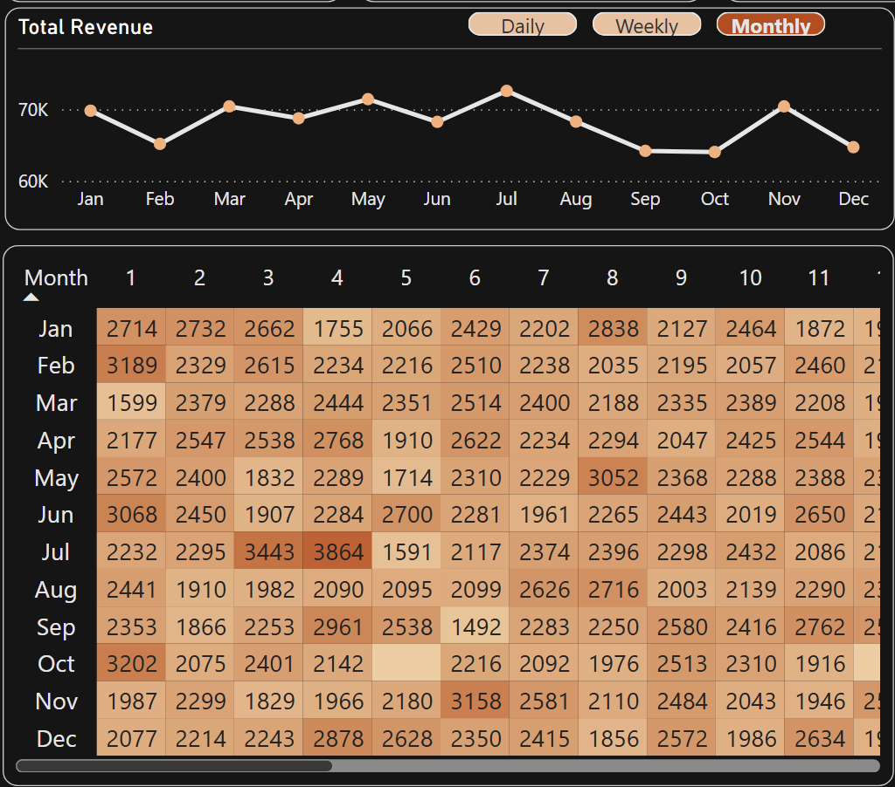

- Revenue remains relatively stable throughout the year, with moderate fluctuations across months. Some months (e.g. July) show higher performance at approximately **~$75K–$78K**, while other months, such as February and October, are slightly lower at around **~$60K–$65K**.
- There is no strong seasonality pattern, and sales performance is fairly consistent over time.

**Impact:**  
Growth is more likely to come from improving product performance rather than relying on seasonal demand.

### 2. Sales by Day and Time
Sales are not evenly distributed across the week:

  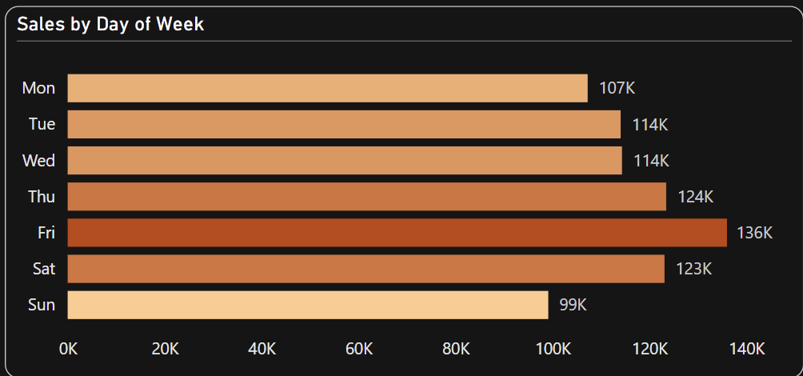

- **Friday** generates the highest revenue (~$136K)  
- **Saturday and Sunday** also perform strongly (~$125K–$130K)  
- Mid-week days such as Tuesday and Wednesday show lower performance (~$110K–$115K)

By time of day:

  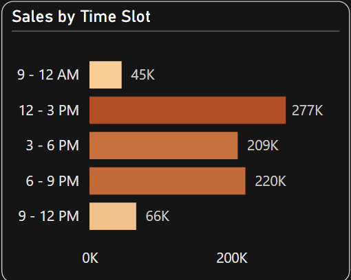

- **Peak period:** 12 PM – 3 PM (~$277K total revenue)  
- **Secondary peak:** 6 PM – 9 PM (~$240K–$250K)  
- **Lowest demand:** early morning (before 9 AM)

Friday generates the highest revenue, followed by weekends. The peak time slot is **12–3 PM**, with strong demand also in the evening **(6–9 PM)**. Customer demand is concentrated around **lunch** and **evening** periods, especially later in the week.

**Impact:**  
Operations, staffing, and promotions should be focused on these peak periods to maximise revenue.

### 3. Order Behaviour

  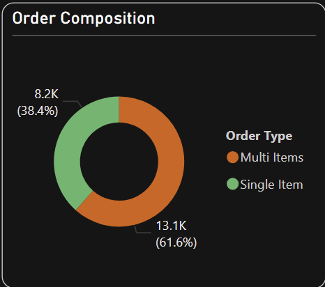

- Multi-item orders: ~61.6%  
- Single-item orders: ~38.4%  
- On average, customers purchase **~2 pizzas per order**.

Customers tend to order multiple items rather than single pizzas. There is strong potential to increase revenue through bundles and upselling.

**Impact:**  
There is strong potential to introduce bundles, encourage upselling, and increase average order value.

### 4. Category Performance

  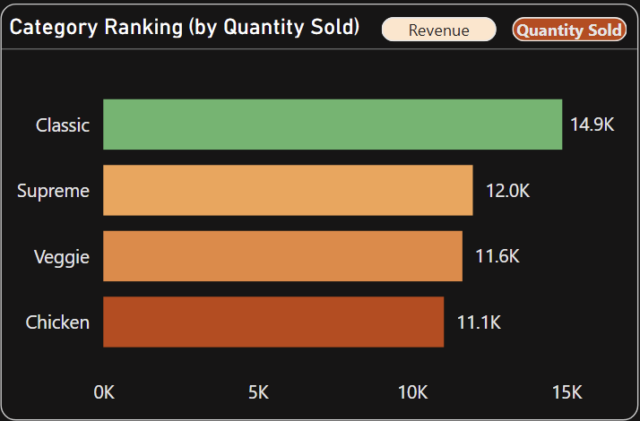
      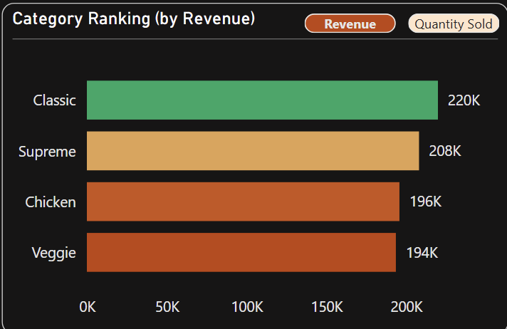

While there are differences in Quantity Sold, Revenue is relatively balanced across categories:

By quantity sold:
- **Classic:** ~14.9K units (highest)  
- **Supreme:** ~12.0K  
- **Veggie:** ~11.6K  
- **Chicken:** ~11.1K  

By revenue (from previous chart):
- Classic still leads (~$220K), but gaps are smaller

Classic pizzas dominate in volume, meaning they are frequently purchased, while other categories perform similarly in terms of revenue.

**Impact:**  
Classic pizzas are likely core menu items that drive consistent demand and should remain central to the product strategy. 

### 5. Top Performing Products  

  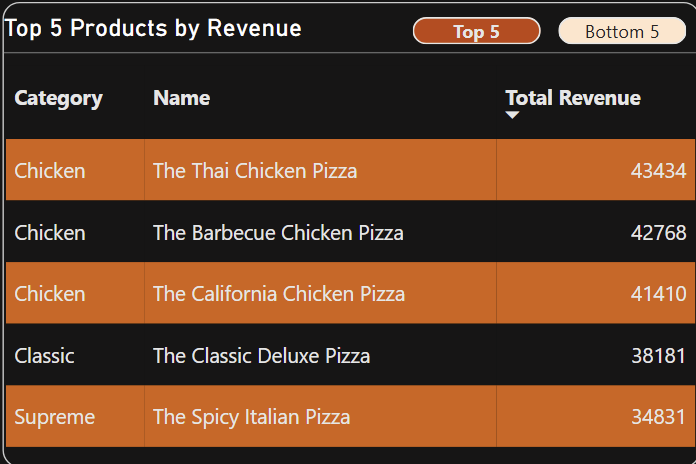
      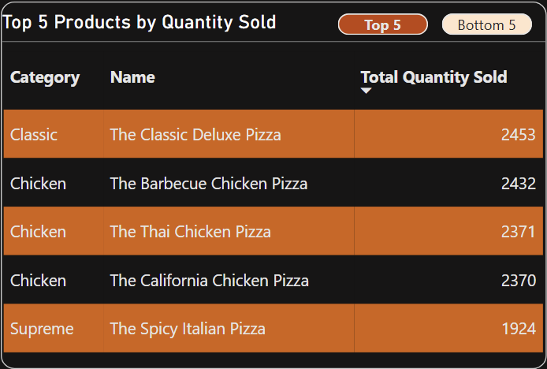

**Top by Revenue:**

- Thai Chicken Pizza → ~$43.4K  
- Barbecue Chicken Pizza → ~$42.8K  
- California Chicken Pizza → ~$41.4K  
- Classic Deluxe Pizza → ~$38.2K  
- Spicy Italian Pizza → ~$34.8K  

**Top by Quantity:**

- Classic Deluxe Pizza → ~2,453 units  
- Barbecue Chicken Pizza → ~2,432  
- Thai Chicken Pizza → ~2,371  
- California Chicken Pizza → ~2,370  
- Spicy Italian Pizza → ~1,924  

High-performing products appear consistently across both revenue and quantity rankings.

**Impact:**  
These pizzas are strong demand drivers and reliable revenue contributors. They should be prioritised in promotions and bundles.

### 6. Product-Level Performance (Underperformers) 

  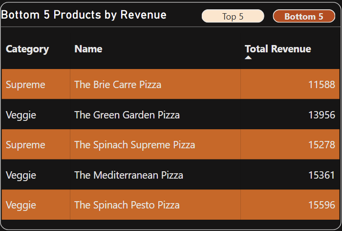
      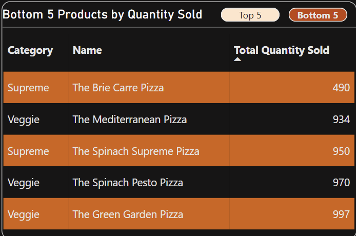

Examples of low-performing products:

- **Brie Carre Pizza** → ~490 units (very low demand)  
- **Spinach Pesto Pizza** → <1,000 units  
- **Mediterranean Pizza** → <1,000 units  

These products appear consistently in both bottom revenue and quantity rankings.
These items have weak demand and low contribution.

**Impact:**  
Keeping these products on the menu may reduce efficiency by increasing ingredient complexity, slowing down operations, and taking attention away from higher-performing items. Therefore, these products should be reviewed for removal, repositioning, or improvement.

### 7. Ingredient Usage & Impact  

  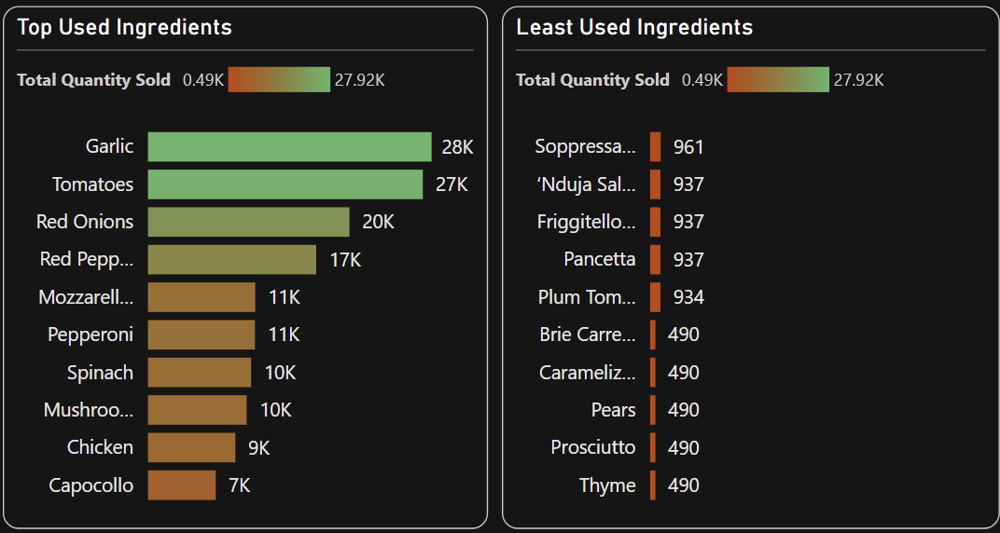

**Most Used Ingredients:**

- Garlic: ~28K usage  
- Tomatoes: ~27K  
- Red Onions: ~20K  
- Red Peppers: ~17K  

**Least Used Ingredients:**

- Brie Carre: ~490  
- Prosciutto: ~490  
- Pears: ~490  

**Ingredient Impact (Revenue vs Demand):**

  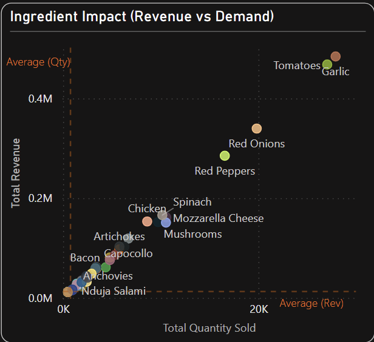

- Ingredients like **Garlic and Tomatoes** are positioned in the high-demand, high-revenue quadrant  
- Ingredients like **Nduja Salami and Anchovies** are low demand and low revenue
  
From the visuals, core ingredients are strongly associated with high-performing pizzas, while niche ingredients contribute little to demand.

**Impact:**  
Ingredient selection directly affects product popularity, cost efficiency, and menu complexity  

### 8. Product Segmentation (Revenue vs Demand)  

  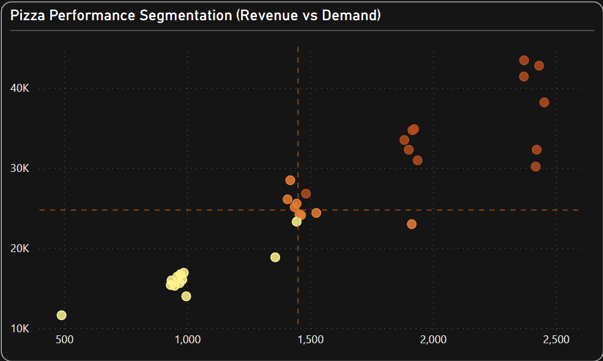
      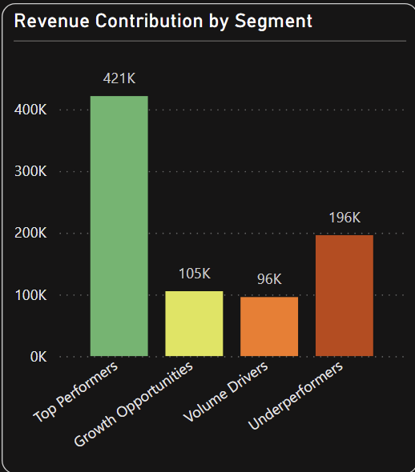

- **Top Performers:** ~$421K (51.5%)  
- **Growth Opportunities:** ~$105K (12.9%)  
- **Volume Drivers:** ~$96K (11.7%)  
- **Underperformers:** ~$196K (23.9%)  

More than half of the revenue comes from a relatively small group of products, while underperformers still account for a significant share.

**Impact:**  
There is a clear opportunity to optimise the product mix, reduce inefficiencies, and focus on high-performing items  

## Key Insights 

- The business generated approximately **$817.9K** in revenue from **21K orders** and **50K pizzas sold**, with an average order value of about **$38.3** and roughly **2 pizzas per order**. Sales remain stable throughout the year with only minor fluctuations, indicating a consistent demand pattern rather than strong seasonality.

- Demand is highly concentrated in specific trading windows. **Fridays** are the strongest sales day, followed by **Thursdays** and **Saturdays**, while the **12 PM – 3 PM** period drives the highest revenue, with evening hours contributing the next largest share. This shows that lunch and dinner are the most critical operating periods.

- Customer ordering behaviour is a key strength. Around **61.6%** of orders contain multiple pizzas, confirming strong bundle-style purchasing behaviour. This indicates clear potential to increase revenue further through upselling, combo offers, and targeted promotions.

- Product and category performance are uneven in ways that directly affect strategy. The **Classic** category leads both in volume and revenue (~$220K), while products such as **The Classic Deluxe Pizza** and **Barbecue Chicken Pizza** consistently perform strongly. In contrast, items like **The Brie Carre Pizza** and **Mediterranean Pizza** show weak demand and low contribution, appearing in bottom rankings across both revenue and quantity.

- Ingredient-level analysis reinforces this imbalance. Core ingredients such as **Garlic**, **Tomatoes**, and **Red Onions** are heavily associated with high-performing products, while low-usage ingredients contribute little to demand but increase operational complexity.

- From a portfolio perspective, performance is heavily concentrated. **Top-performing products contribute ~51.5% of total revenue**, while **underperformers contribute ~23.9% of revenue (~$196K)**.

- At the same time, underperforming products make up a relatively large share of the menu (e.g. ~37.5% of total items), indicating that a significant portion of products contribute disproportionately less value.

**Overall Issue:**  
The menu is not fully optimised. Revenue is driven by a relatively small set of products and ingredients, while a large number of low-performing items increase complexity without contributing meaningful value. Therefore, a more focused and balanced product mix could achieve similar or higher revenue with improved operational efficiency.

## Recommendations

### 1. Focus on Top Performers (Core Revenue Drivers)
Top-performing pizzas contribute ~51.5% of total revenue and consistently rank high in both revenue and quantity.

- Prioritise these products in promotions and featured menus  
- Ensure consistent availability during peak periods  
- Use them as anchors in bundle deals  

**Expected Impact:** Protect and scale the main revenue drivers while maximising returns during high-demand periods  

### 2. Reduce Menu Complexity (Address Underperformers)
Underperforming pizzas make up ~37.5% of the menu but contribute only ~23.9% of revenue (~$196K).

- Remove or consolidate low-performing items (e.g. Brie Carre, Mediterranean Pizza)  
- Reposition selected items with improved recipes or pricing  
- Reduce reliance on low-impact ingredients  

**Expected Impact:** Simplified operations, lower ingredient costs, and improved overall menu efficiency  

### 3. Grow High-Potential Products (Growth Opportunities)
Some products generate strong revenue but have lower demand compared to top performers.

- Increase visibility through menu placement and promotions  
- Test small price adjustments to improve accessibility  
- Bundle with top-performing products  

**Expected Impact:** Increased demand for already strong products, improving overall revenue distribution  

### 4. Improve Revenue from High-Volume Products (Volume Drivers)
Certain pizzas sell well in quantity but generate lower revenue per item.

- Introduce upselling strategies (e.g. add-ons, premium toppings)  
- Test slight price increases where demand is stable  
- Bundle with higher-margin items  

**Expected Impact:** Higher average order value without reducing order volume  

### 5. Leverage Peak Demand Periods
Demand is concentrated on **Fridays, weekends**, and during **12 PM–3 PM and 6 PM–9 PM**.

- Align staffing and preparation capacity with peak hours  
- Run targeted promotions during these time windows  
- Ensure top-performing products are readily available  

**Expected Impact:** Increased revenue capture during peak demand and reduced lost sales opportunities  

### 6. Optimise Bundle & Upselling Strategy
With ~61.6% of orders containing multiple pizzas, customers already show strong bundle behaviour.

- Introduce combo deals (e.g. “2 pizzas + drink”)  
- Offer discounts for additional items rather than single-item discounts  
- Promote larger orders during peak periods  

**Expected Impact:** Increased average order value and improved revenue per transaction  

### 7. Optimise Ingredient Strategy
Core ingredients (e.g. garlic, tomatoes, red onions) are strongly linked to high-performing products, while low-usage ingredients add complexity.

- Focus menu design around high-performing ingredients  
- Reduce or eliminate rarely used ingredients  
- Standardise ingredient usage across products  

**Expected Impact:** Lower inventory complexity, reduced costs, and improved operational efficiency  

## Tools Used

- Power BI
- DAX
- Data Modelling
- Data Visualisation

## Project Visuals

| Cover | Dashboard |
| --- | --- |
|  |  |

## Repository Contents

| File | Purpose |
| --- | --- |
| [`pizza_sales_project.pbix`](./pizza_sales_project.pbix) | Power BI dashboard file |
| [`data_pizza.xlsx`](./data_pizza.xlsx) | Source dataset used for analysis |
| [`data_dictionary.xlsx`](./data_dictionary.xlsx) | Data dictionary for business fields and definitions |
| [`images/hero.png`](./images/hero.png) | Project cover image used in the README |
| [`images/dashboard-preview.png`](./images/dashboard-preview.png) | Dashboard screenshot preview |
